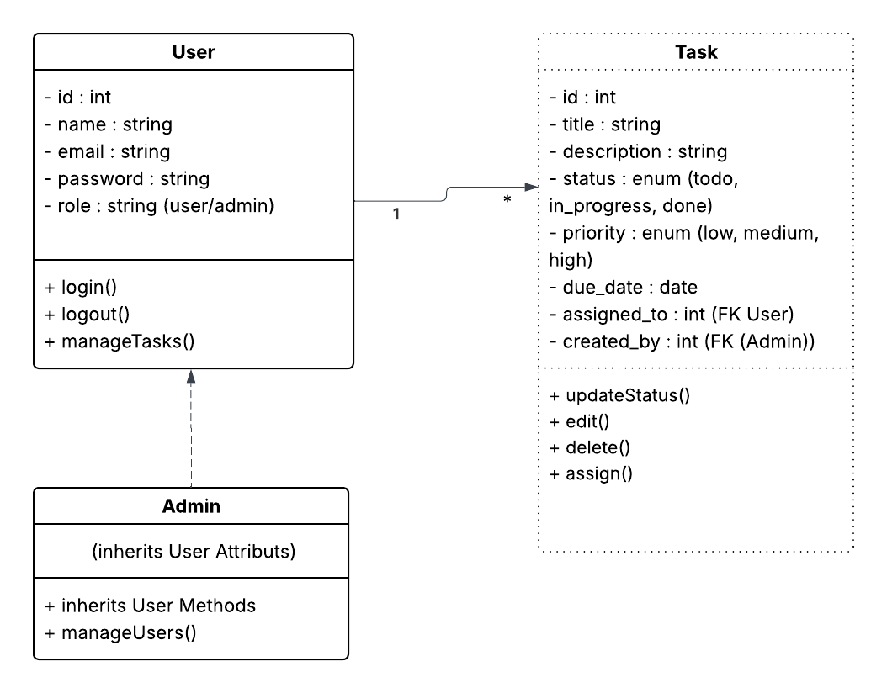
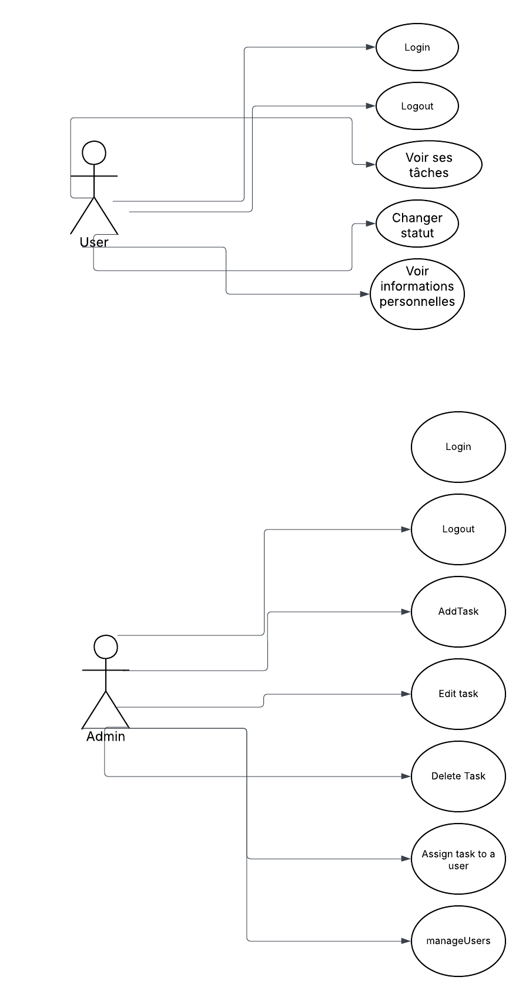

# TaskFlow — README

> Outil interne pour organiser et suivre les tâches des équipes.

---

## 📌 Aperçu du projet

TaskFlow est une application full-stack permettant aux utilisateurs de créer, attribuer, suivre et modifier l'état des tâches.  
Le projet comprend :

- **Backend** : API REST en Laravel (authentification, gestion BDD, endpoints pour users & tasks).
- **Frontend** : SPA en React consommant l'API Laravel.

## 🖥️ Fonctionnalités

### Backend (Laravel)

- Auth via Laravel Breeze (API).
- Endpoints REST :
  - `POST /api/register` — enregistrement
  - `POST /api/login` — connexion
  - `POST /api/logout` — déconnexion
  - `GET /api/admin` — infos utilisateur (auth)
  - `CRUD /api/tasks` — gestion des tâches
  - `CRUD /api/users` — gestion utilisateurs (admins seulement)
- Relations Eloquent : `User (1) — (N) Task`
- Migrations, seeders et factories pour peupler la base.

### Frontend (React)

- Pages : Login, Register, Dashboard, Create/Edit Task, Admin.
- Axios pour les appels API.
- Gestion des états (loading, erreurs) et feedback utilisateur (toasts).
- Navigation via React Router.

---

## ⚙️ Stack technique

- **Backend** : Laravel 10, Eloquent, MySQL
- **Auth** : Laravel Breeze (API, tokens)
- **Frontend** : React, Axios, React Router, react-toastify,SweetAlertJs
- **Outils** : Postman, Git/GitHub

---

## 📁 Structure du dépôt

- backend/ # Laravel app
- app/
- database/
- routes/api.php
- frontend/ # React app
- src/
- public/
- README.md # ce fichier

### 🚀 Installation (local)

#### Backend

- cd backend
- composer install
- cp .env.example .env
- php artisan key:generate

# Configurer .env (DB, MAIL, etc.)

php artisan migrate --seed
php artisan serve

### frontend

cd frontend
npm install

# Configurer API URL si nécessaire

npm start

## Démonstration — scénario recommandé

- Register / Login (montrer token côté devtools ou confirmer login).

- Créer une tâche, l’assigner à un utilisateur.

- Modifier une tâche : changer titre / description / statut / priority .

- Supprimer une tâche.

- Basculement rôle admin : montrer la page de gestion des utilisateurs.

- Simuler erreur (API down) pour montrer la gestion d’erreur.

## 🔐 Sécurité & bonnes pratiques

- Valider toutes les entrées côté serveur.

- Protéger les routes admin avec auth + middleware de rôle.

- Pour prod, privilégier cookies HttpOnly pour les tokens

## Ressources utiles

- Laravel Docs: https://laravel.com/docs

- React Docs: https://reactjs.org/docs/getting-started.html

- Axios: https://axios-http.com/

### Diagramme de classes



### Diagramme de cas d'utilisation



```

```
